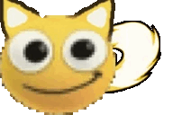

# Aga Clicker

### A short, funny(?) clicker game inspired by [Stimulation Clicker](https://neal.fun/stimulation-clicker/)

---

## How It was made
### I used:
- WebStorm for coding (and this README)
- GIMP for image editing
- Inkscape for creating and editing vector icons 

The code only uses basic HTML, CSS and JS :D

## How To Run/Edit The Project Locally
Just download the files and... done! No special set up is needed. ~~*well you do need a browser ig*~~

Simply double-click the HTML file to open the website or open the folder in an IDE to edit

## FAQ
### Why?
- Well, uh... you see. Aga.

### Should I Try Playing Rain World?
- Yes!

## Random Ideas For Later ;)
- skins
- leaderboard
- multipliers as part of other upgrades
- better style as upgrade
- hydraulic press
- slugcat 
- background skins
- custom colors
- visual upgrade to finger and hammer at some point
- some music player
- rgb gaming lights
- explosion sfx on click
- different screens/rooms
- flamethrower
- subway surfer aga
- rain
- name aga
- credits
- some kind of slack integration
- cps counter
- aga balls

## AI Disclosure 
I used AI to help with CSS (For example: How to create a gradient) and to understand and fix some bugs.

Also, the particle physics were made with quite a lot of AI help unfortunately

---

 
 
 
 
 

~~*also apparently this emoji is a twitch joke or something?\
I just found this emoji with my friend, and we thought it looked funny lol*~~